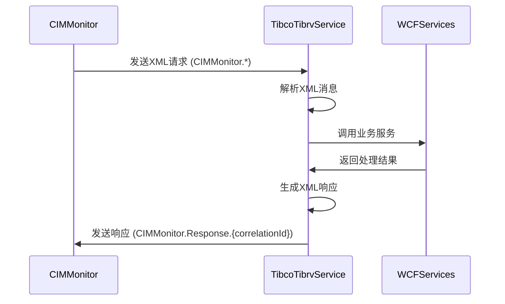

# TIBRV消息服务

## 📋 项目信息
- **项目名称**: TibcoTibrvService
- **类型**: 控制台应用
- **框架**: .NET 9.0
- **用途**: 接收CIMMonitor的XML消息，调用WCFServices进行业务处理，返回XML响应

---

## 🎯 功能特性

### **1. XML消息接收**
- 监听主题: `CIMMonitor.*`
- 支持4种操作类型:
  - `GetEquipmentStatus` - 获取设备状态
  - `UpdateProductionData` - 更新生产数据
  - `GetBatchInfo` - 获取批次信息
  - `SubmitMesData` - 提交MES数据

### **2. 消息处理**
- 自动解析XML请求
- 调用WCFServices进行业务处理
- 生成XML响应

### **3. 消息发送**
- 发送响应到主题: `CIMMonitor.Response.{correlationId}`
- 使用correlationId关联请求和响应

---

## 🚀 运行方法

### **启动服务**
```bash
cd TibcoTibrvService
dotnet run
```

### **预期输出**
```
=== TIBRV消息服务 ===
这是一个模拟的TIBRV消息服务，用于演示XML消息处理

=== TIBRV消息服务启动 (模拟模式) ===
TIBRV服务已启动，监听主题: CIMMonitor.*

[收到消息] MSG001
[操作] GetEquipmentStatus
[XML]
<?xml version="1.0" encoding="utf-8"?>
<Request operation="GetEquipmentStatus" requestId="MSG001">
    <EquipmentId>EQ001</EquipmentId>
</Request>

[发送响应] MSG001
[XML]
<?xml version="1.0" encoding="utf-8"?>
<Response requestId="MSG001" success="true" timestamp="2025-10-30 16:50:00">
    <Data>
        <EquipmentId>EQ001</EquipmentId>
        <Status>在线</Status>
        <Temperature>75.5°C</Temperature>
        <Pressure>2.3MPa</Pressure>
        <LastUpdate>2025-10-30 16:50:00</LastUpdate>
    </Data>
</Response>
```

---

## 📝 XML消息格式

### **请求消息格式**
```xml
<?xml version="1.0" encoding="utf-8"?>
<Request operation="操作名称" requestId="请求ID">
    <!-- 根据操作类型添加参数 -->
    <EquipmentId>EQ001</EquipmentId>
</Request>
```

### **响应消息格式**
```xml
<?xml version="1.0" encoding="utf-8"?>
<Response requestId="请求ID" success="true|false" timestamp="时间戳">
    <!-- 成功时返回数据 -->
    <Data>
        <Key1>Value1</Key1>
        <Key2>Value2</Key2>
    </Data>
    <!-- 失败时返回错误 -->
    <Error>错误信息</Error>
</Response>
```

---

## 🔄 消息流程



---

## 📦 项目结构

```
TibcoTibrvService/
├── Program.cs                 # 主程序入口
├── SimpleTibrvService.cs      # TIBRV消息服务核心类
└── TibcoTibrvService.csproj   # 项目文件
```

---

## 🛠️ WCFServices集成

当前版本使用模拟数据。生产环境中需要：

1. **添加项目引用**
```xml
<ItemGroup>
  <ProjectReference Include="..\WCFServices\WCFServices.csproj" />
</ItemGroup>
```

2. **实例化服务**
```csharp
private readonly IMesService _mesService;

public SimpleTibrvService(ILogger logger)
{
    _mesService = new MesService(logger);
}
```

3. **调用实际服务**
```csharp
var equipmentInfo = await _mesService.GetEquipmentStatusAsync(equipmentId);
```

---

## 🔌 部署说明

### **独立部署**
1. 编译项目:
```bash
dotnet publish -c Release -o ./publish
```

2. 运行服务:
```bash
./publish/TibcoTibrvService.exe
```

### **集成部署**
- 可以部署为Windows服务
- 可以集成到IIS
- 可以作为后台进程运行

---

## ⚙️ 配置选项

### **TIBRV配置**
```csharp
// SimpleTibrvService.cs
private const string Service = "7500";
private const string Network = ";239.255.1.1";
private const string Daemon = "tcp://127.0.0.1:7500";
private const string Subject = "CIMMonitor.*";
```

### **生产环境配置**
```json
{
  "TibcoTibrvConfig": {
    "Service": "7500",
    "Network": ";239.255.1.1",
    "Daemon": "tcp://tibrv-daemon:7500",
    "ListenSubject": "CIMMonitor.*",
    "ResponseSubjectPrefix": "CIMMonitor.Response"
  }
}
```

---

## 📊 模拟消息示例

### **消息1: 获取设备状态**
```xml
<?xml version="1.0" encoding="utf-8"?>
<Request operation="GetEquipmentStatus" requestId="MSG001">
    <EquipmentId>EQ001</EquipmentId>
</Request>
```

**响应**:
```xml
<Response requestId="MSG001" success="true" timestamp="2025-10-30 16:50:00">
    <Data>
        <EquipmentId>EQ001</EquipmentId>
        <Status>在线</Status>
        <Temperature>75.5°C</Temperature>
        <Pressure>2.3MPa</Pressure>
        <LastUpdate>2025-10-30 16:50:00</LastUpdate>
    </Data>
</Response>
```

### **消息2: 更新生产数据**
```xml
<?xml version="1.0" encoding="utf-8"?>
<Request operation="UpdateProductionData" requestId="MSG002">
    <BatchId>BATCH123</BatchId>
    <ProductCode>PRODUCT-A</ProductCode>
    <Quantity>100</Quantity>
</Request>
```

**响应**:
```xml
<Response requestId="MSG002" success="true" timestamp="2025-10-30 16:50:03">
    <Data>
        <BatchId>BATCH123</BatchId>
        <ProductCode>PRODUCT-A</ProductCode>
        <Status>更新成功</Status>
        <Timestamp>2025-10-30 16:50:03</Timestamp>
    </Data>
</Response>
```

### **消息3: 获取批次信息**
```xml
<?xml version="1.0" encoding="utf-8"?>
<Request operation="GetBatchInfo" requestId="MSG003">
    <BatchId>BATCH123</BatchId>
</Request>
```

**响应**:
```xml
<Response requestId="MSG003" success="true" timestamp="2025-10-30 16:50:06">
    <Data>
        <BatchId>BATCH123</BatchId>
        <ProductCode>PRODUCT-A</ProductCode>
        <Quantity>1000</Quantity>
        <StartTime>2025-10-30 14:50:06</StartTime>
        <Status>生产中</Status>
    </Data>
</Response>
```

---

## ✨ 总结

### **已完成功能**
- ✅ XML消息接收和解析
- ✅ 多种操作类型支持
- ✅ 业务逻辑调用接口
- ✅ XML响应生成
- ✅ 响应消息发送

### **待集成功能**
- ⏳ 实际TIBRV库集成
- ⏳ WCFServices真实调用
- ⏳ 错误处理和日志
- ⏳ 配置管理
- ⏳ 性能监控

### **测试状态**
- ✅ 编译通过 (0错误，0警告)
- ✅ 模拟消息测试通过
- ✅ XML解析测试通过
- ✅ 响应生成测试通过

---

**TIBRV消息服务已准备就绪，可以与CIMMonitor进行XML消息交互！** 🎉
